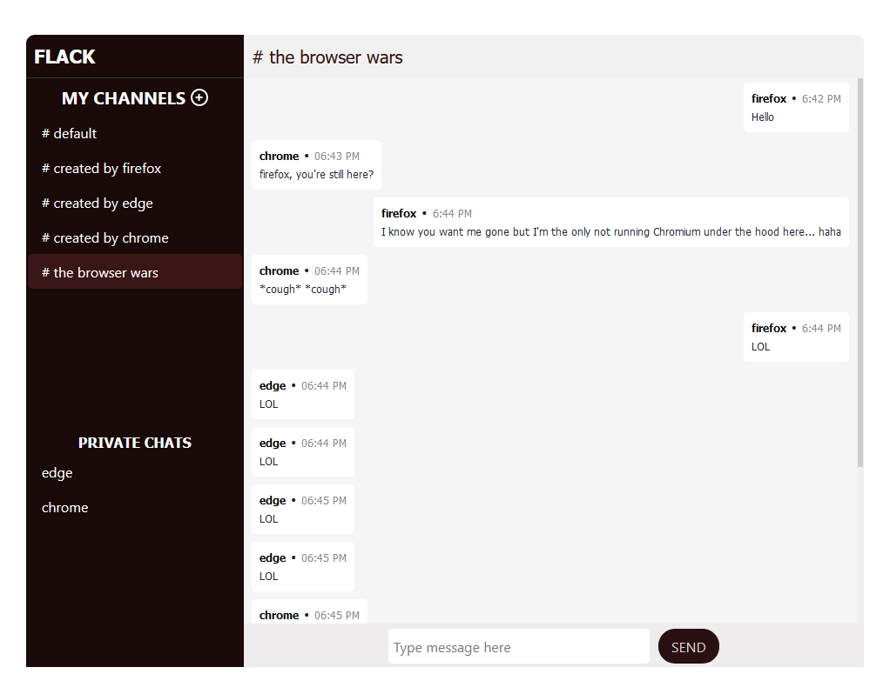

# Flack overview

Flack is web app messaging application that built for messaging. This application allows users send messages to channels they have created or have been created by others, and/or send private messages to other users. All messages and created channels are stored in memory so all chat will be lost once the server is restarted.

## Registration

Users can register using any username, provided that username has not been chosen by another user. Users do not need passwords to register. User's registration is stored in local storage so the user is identified through all browsing sessions. This makes it possible for the user to continue chatting without re-registering when the user closes and re-opens the browser or closes the chat tab.

## Homepage

Once a user successfully registers using a unique username, the user is redirected to the homepage of the web application; where the user can create a new channel, join existing channels or text other users privately.

## Creating channels

Any user can create a channel by clicking the plus ⨁ icon next to **MY CHANNEL**. Once a user creates a channel, this channel is displayed to other users who can join; send and receive messages from the created channel.

## Joining channels

In order to send a message, the user must first join a channel. To do this, the user just needs to click on the name of the channel s/he wishes to join.

## Sending messages - channels

To send messages to channels, the user needs to click on the channel name, type the message in the text field and hit send.

## Sending messages - private
The user needs to click on the username of the user s/he wishes to send the message to under **PRIVATE CHATS**, type the message and hit send.

# Files

## Back end

### [application.py](application.py "application.py")
    This powers the backend of the app. The file contains all the apps flask routes as well as socketio routes. It controls creating display name, creating new channels, storing of messages in memory, storing of channels in memory, messaging and private messaging, emitting messages and channels to the frontend among others.

        # requirements.txt
    Contains all python packages needed to run the app

## /static

        # script.js
    Contains most of the javascript code that controls the app on the frontend. It controls creating channels and messaging.

        # style.css
    Contains the design of all pages

        # style.scss
    Sass file for style.css

## /templates

        # create.html
    User registration page

        # index.html
    The main page - messaging, channel creation.

        # layout.html
    Main layout of the app. It also contains handlebars templates for messaging and channel creation.