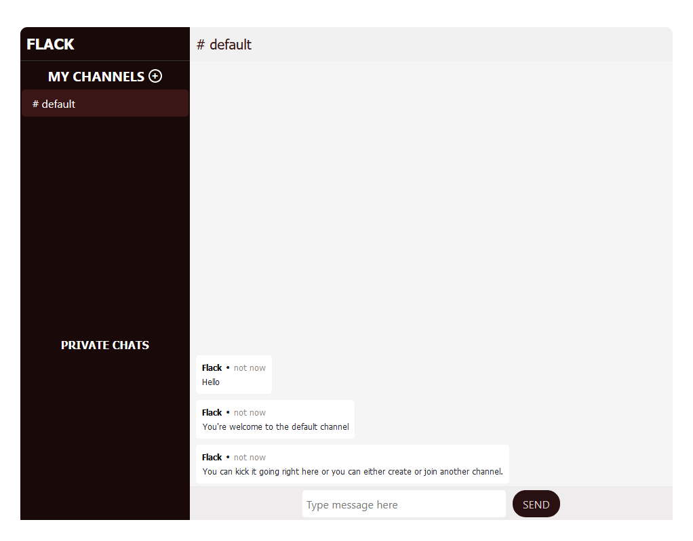

# Flack overview

Flack is web app messaging application that built for messaging. This application allows users send messages to channels they have created or have been created by others, and/or send private messages to other users. All messages and created channels are stored in memory so all chat will be lost once the server is restarted.

## Registration

Users can register using any username, provided that username has not been chosen by another user. Users do not need passwords to register. User's registration is stored in local storage so the user is identified through all browsing sessions. This makes it possible for the user to continue chatting without re-registering when the user closes and re-opens the browser or closes the chat tab.

## Homepage

Once a user successfully registers using a unique username, the user is redirected to the homepage of the messaging web application; where the user can create a new channel, join an existing channel or text users privately.

## /templates

        # create.html
    User registration page

        # index.html
    The main page - messaging, channel creation.

        # layout.html
    Main layout of the app. It also contains handlebars templates for messaging and channel creation.
